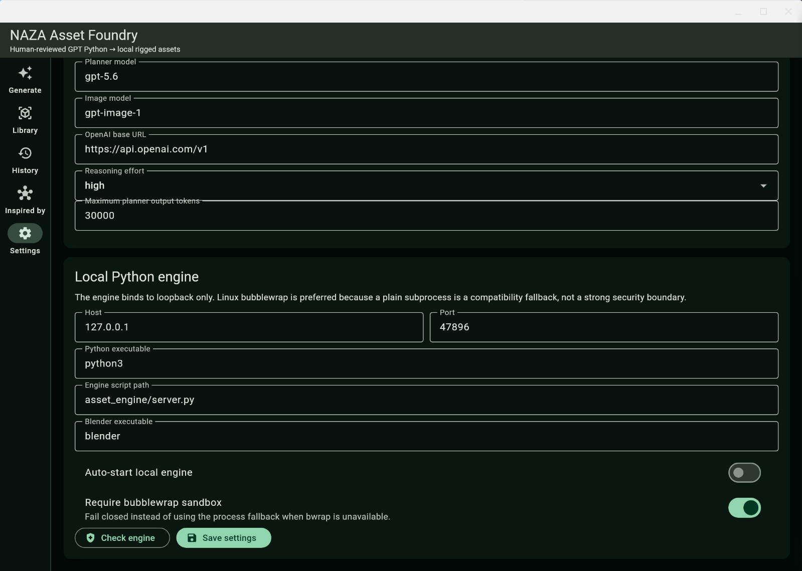
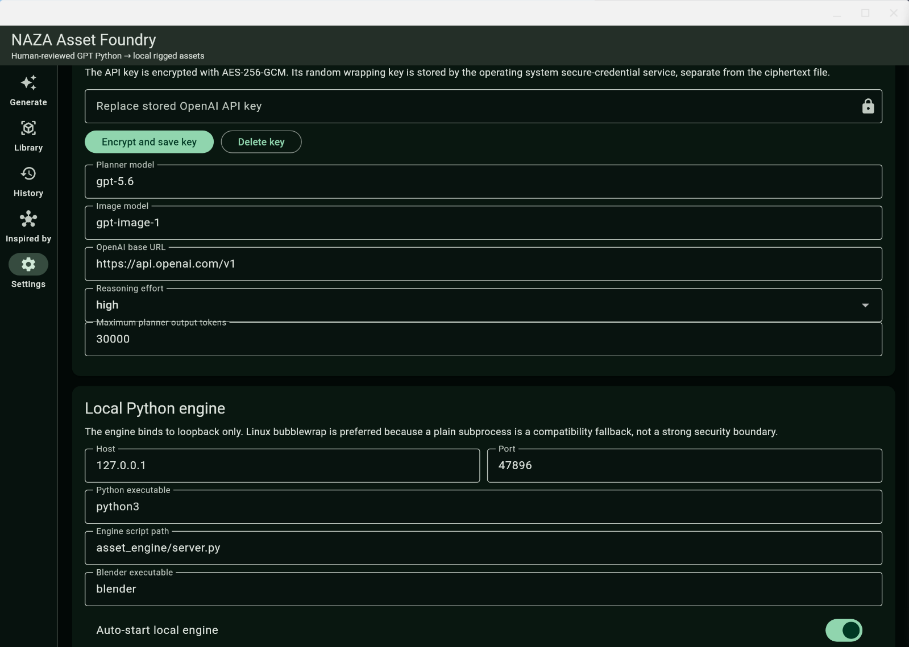
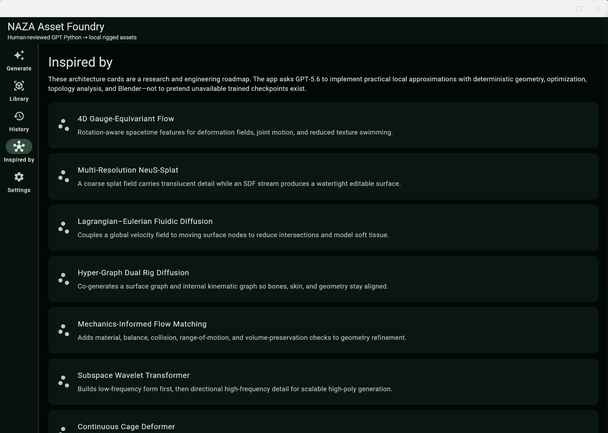
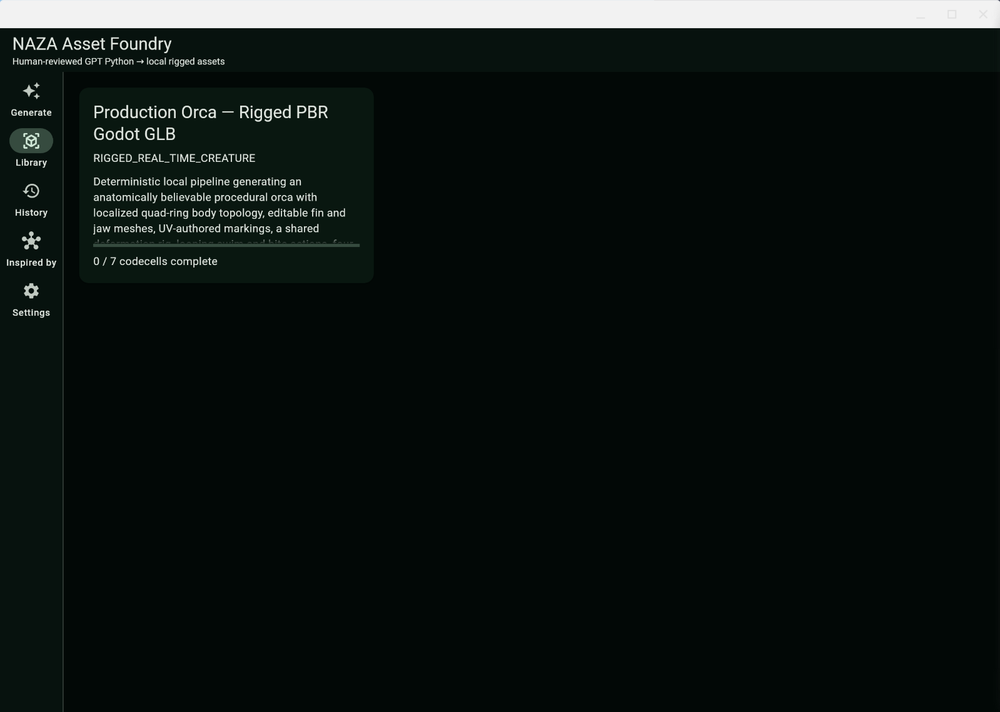
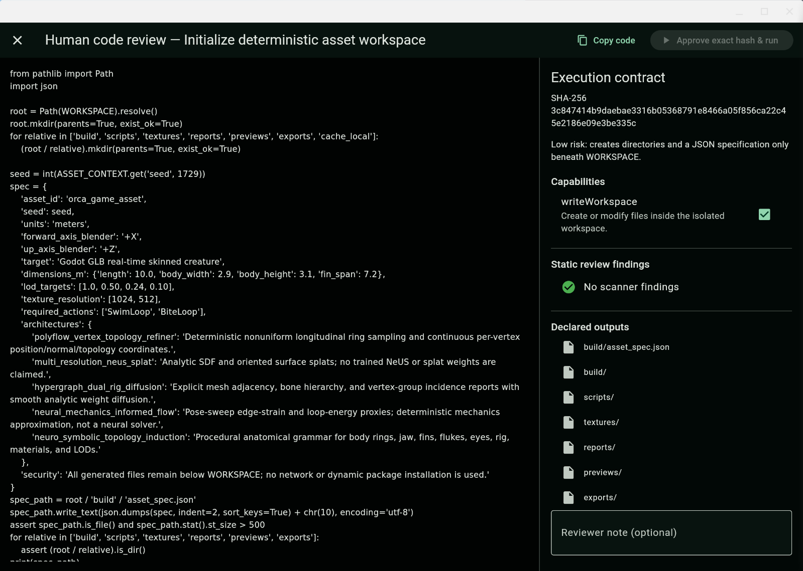
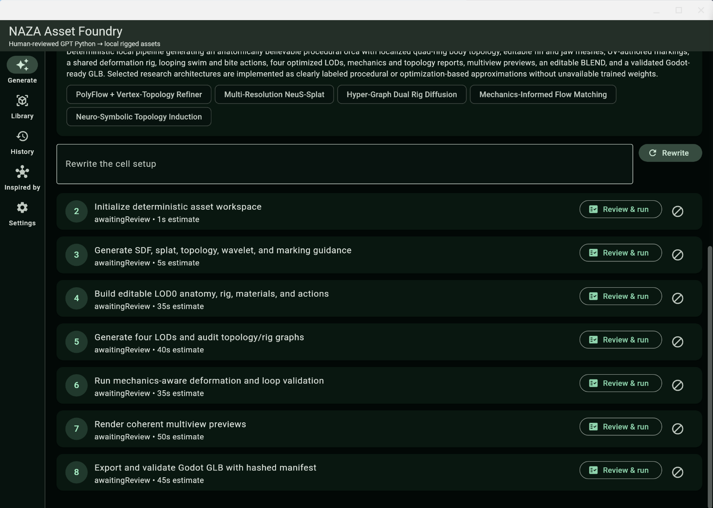
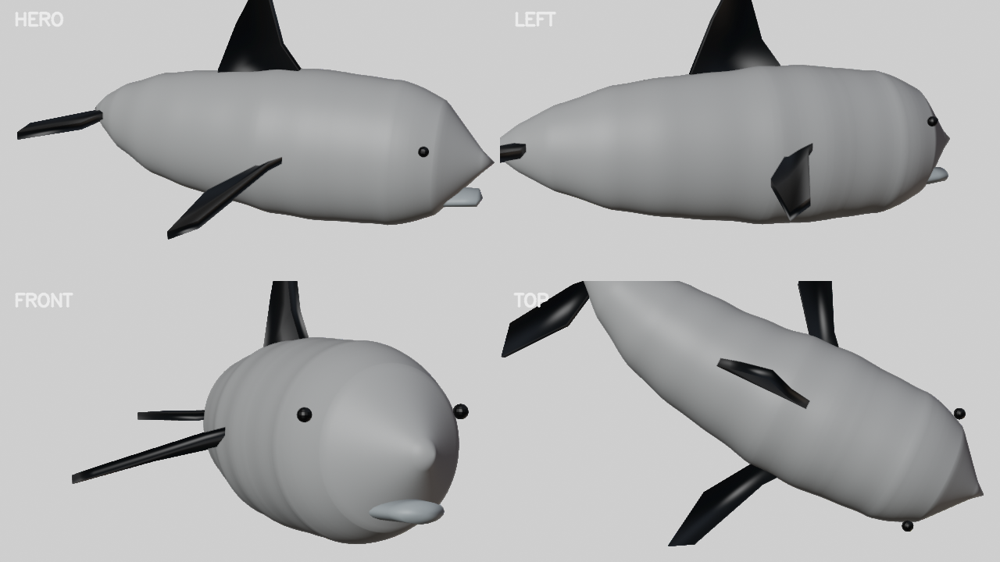

# NAZA Asset Foundry

A standalone Flutter/Dart application plus a local Python execution engine for
creating editable, rigged game assets from text or reference images.

GPT-5.6 may design custom Python codecells. A cell cannot execute until the user
opens the full human-review popup and approves the exact source hash and allowed
capabilities. Any source change invalidates approval.

## Included

- Flutter pages for Generate, Generate from Image, Library, History, Inspired By,
  and Settings.
- GPT-5.6 structured codecell planner and GPT Image concept-sheet generation.
- AES-256-GCM encrypted API-key storage with the wrapping key held in OS secure
  storage.
- SQLite plan, execution, artifact, settings, and approval history.
- Python/NumPy/OpenCV/SciPy/trimesh asset engine.
- Exact SHA-256 review binding, AST policy checks, loopback-only service,
  permission-scoped execution, resource limits, and optional bubblewrap.
- Optional headless Blender compilation and export.
- The two source notebooks under `reference_notebooks/`.

## Demo gallery

The following screenshots show the Orca rigged-asset workflow from configuration
through review and execution.

### 1. Local engine and model settings

Configure the planner and image models, Python engine endpoint, Blender path,
auto-start behavior, and sandbox policy.



### 2. API-key configuration

The OpenAI API key is entered and encrypted before the planner or image
generation actions are used.



### 3. Architecture roadmap

The Inspired By page documents the research-inspired architectures used as
practical deterministic or optimization-based pipeline components.



### 4. Orca asset in the library

An example production target: a rigged PBR orca prepared for real-time Godot
GLB export.



### 5. Human code review

Each codecell is shown with its exact SHA-256 contract, requested capability,
static findings, and declared outputs before execution.



### 6. Orca codecell pipeline

The generated pipeline separates workspace initialization, geometry and rig
construction, LOD generation, validation, previews, and final Godot GLB export.



## Complete Orca demonstration

The repository includes a curated bundle from a successful end-to-end Orca
run:

- [Download the successful Orca bundle](demo_assets/naza_orca_success_bundle.zip)
- [Open the Godot GLB](demo_assets/orca_success_bundle/exports/orca_godot.glb)
- [Open the editable Blender source](demo_assets/orca_success_bundle/exports/orca_production.blend)
- [Read the 32-artifact manifest](demo_assets/orca_success_bundle/exports/asset_manifest.json)
- [View the generated contact sheet](demo_assets/orca_success_bundle/previews/orca_contact_sheet.png)

The archive contains the successful result logs for codecells 1–7, approval
records, the asset context, reports, previews, textures, Blender source, Godot
GLB, manifest, and the six application demo screenshots. The manifest reports
32 exported artifacts, four LOD levels, one skin, three animations, 37 meshes,
54 nodes, four PBR materials, and successful mechanics validation.

### Example Orca prompt

This is the prompt used for the demonstration asset:

> A production-ready, rigged orca whale game asset with realistic black-and-white markings, clean deformation topology, expressive fins and tail, believable anatomy, four optimized LODs, PBR materials, and Godot-ready GLB export. Include clean looping deformation around the jaw, pectoral fins, dorsal fin, and tail. Make it editable, animation-ready, and suitable for real-time use.

The prompt is intentionally specific about the deliverable, not only the
appearance. It names the subject, visual identity, topology requirements,
rigging requirements, runtime constraints, material expectations, animation
requirements, LOD targets, and export format.

## How to write prompts with a model

A useful asset prompt can be drafted with any capable language model before it
is submitted to NAZA. Ask the model to act as a technical art director and
return a compact production brief containing these fields:

```text
Create a production asset brief for a local procedural Blender pipeline.

Subject: [creature, character, prop, vehicle, environment]
Art direction: [silhouette, anatomy, style, colors, markings, materials]
Topology: [deformation zones, quad flow, seam or edge-loop priorities]
Rigging: [bones, controls, joints, required actions]
Runtime: [target engine, triangle budgets, collision needs, texture limits]
LOD: [number of levels and approximate use cases]
Validation: [checks that must pass]
Export: [GLB, BLEND, textures, reports, naming conventions]

Return one polished paragraph and a short checklist. Do not invent trained
weights or external assets; describe deterministic procedural approximations
when a specialized model is unavailable.
```

Then turn the result into a direct NAZA prompt. A strong prompt usually answers
seven questions:

1. What is being made?
2. What must it look like and what must remain recognizable?
3. Where must it deform, articulate, or animate?
4. What topology, rig, material, and texture constraints matter?
5. What LOD and performance budget should guide construction?
6. What validations and reports are required?
7. Which engine and file formats must receive the result?

For example, a model-assisted prompt for a stylized robot could be refined into:

> Create a production-ready stylized quadruped exploration robot for Godot. Use a readable four-legged silhouette, hard-surface panel seams, two articulated camera arms, independently steerable feet, clean deformation around the leg joints, four optimized LODs, baked PBR materials, collision geometry, deterministic naming, and a validated rig with WalkLoop, ScanLoop, and DeployTool actions. Export an editable BLEND, a Godot-ready GLB, preview renders, topology and rig reports, and a hashed manifest. Keep the pipeline local and deterministic; use procedural Blender geometry and clearly label any research-inspired approximation rather than claiming unavailable trained weights.

The model should help structure intent, but the creator remains responsible for
art direction and human review. NAZA then converts that brief into ordered
codecells, displays the source and capability requests, binds approval to a
SHA-256 hash, and executes the accepted pipeline locally.

## Refinement passes

Refinement works best as a sequence of focused rewrite prompts. Do not ask one
rewrite to solve anatomy, materials, topology, rigging, performance, and export
all at once. Each pass should have one primary objective, a measurable success
condition, and permission to preserve what already works.

### Pass 1 visual checkpoint

This is the Orca Pass 1 checkpoint: the asset has a readable body, fins, tail,
eyes, and a stable multi-view silhouette. It is intentionally a blockout-level
milestone. Later passes can improve anatomy, markings, deformation, materials,
and presentation without losing the reproducible baseline.



The image is a checkpoint, not the entire deliverable. The corresponding build
also contains editable Blender data, a rig, LODs, reports, textures, and a
Godot-ready GLB. This distinction is important: a preview answers “does the
asset read visually?”, while the manifest and reports answer “is the asset
structured and valid for production?”

In the Generate page, place the instruction in **Rewrite the cell setup** and
choose **Rewrite**. Review every changed cell again. A rewrite creates new code
and therefore produces a new SHA-256 approval requirement; an old approval never
silently authorizes changed source.

### Pass 1 — silhouette and anatomy

Start by correcting the largest visual problems. Keep the existing asset ID,
file names, actions, and export contracts stable.

```text
Refine the existing orca asset's primary silhouette and anatomy. Preserve the
current plan ID, four LOD targets, rig action names, output paths, and Godot GLB
contract. Improve the melon-shaped head, taper the body naturally toward the
peduncle, shape a broad tail with recognizable flukes, attach the dorsal and
pectoral fins with smooth transitions, and make the jaw read as an orca rather
than a generic whale. Use deterministic procedural geometry only. Add an
anatomy report with body length, fin span, bounding box, and checks for detached
or intersecting primary parts.
```

Review the hero, front, and top previews before continuing. If the silhouette
is still wrong, repeat this pass before adding detail.

### Pass 2 — orca markings and materials

Once the body reads correctly, improve recognition through the black-and-white
pattern and material separation.

```text
Refine the existing orca materials and UV-authored markings without changing
the mesh proportions or rig hierarchy. Add a clean black dorsal region, white
belly, white eye patch, gray saddle patch, and restrained glossy eyes. Keep the
materials compatible with Godot glTF PBR export and avoid painted text or
logos. Generate deterministic base-color, roughness, and normal inputs where
appropriate. Validate that the material slots are named, textures exist, UVs
are within the expected range, and the final GLB references every required
texture.
```

This pass should make the asset recognizable even in a small thumbnail without
changing the geometry pass that established the silhouette.

### Pass 3 — topology and deformation

Use the third pass to improve places that must bend: jaw, pectoral fins, dorsal
fin base, peduncle, and tail.

```text
Refine deformation topology around the jaw hinge, pectoral-fin roots, dorsal
fin base, peduncle, and fluke roots. Preserve the outer silhouette, material
names, LOD naming, and existing action names. Add localized support loops and
smooth quad-oriented transitions where they improve deformation, reduce
pinching, and avoid sudden volume loss. Produce a topology report with vertex
and face counts, non-manifold checks, disconnected-component checks, and a list
of deformation zones. Do not replace the asset with a static primitive model.
```

The output should be judged in poses, not only at rest. A good topology pass is
visible in the jaw and tail motion even when the neutral silhouette changes very
little.

### Pass 4 — rig and animation behavior

After topology is stable, improve control and motion quality.

```text
Refine the existing orca rig while preserving bone names used by the current
Godot export. Keep SwimLoop and BiteLoop, and add or improve a gentle TailWave
only if it does not break compatibility. Use smooth weights around the jaw,
peduncle, dorsal fin, pectoral fins, and flukes. Add deterministic pose checks
at neutral, swim crest, tail bend, jaw open, and bite poses. Report maximum
vertex displacement, extreme joint strain, missing weights, and whether every
action has keyframes. Export the same editable BLEND and GLB contracts.
```

Do not accept a rig pass merely because an armature exists. Inspect the posed
previews and the action list in the target engine.

### Pass 5 — LOD and real-time performance

Once visual and deformation quality are acceptable, make the asset practical
for a game runtime.

```text
Optimize the existing orca for real-time use without degrading LOD0. Preserve
the rig, materials, action names, and export paths. Build four LODs with clear
triangle and texture targets: cinematic LOD0, gameplay LOD1, mid-distance LOD2,
and silhouette-only LOD3. Keep the dorsal fin, jaw, eyes, and flukes readable
at the appropriate distance. Add collision geometry and a performance report
containing vertex counts, triangle counts, material counts, texture dimensions,
and estimated memory. Validate that all LODs remain exportable and that the
runtime GLB contains the intended skin and animations.
```

Performance refinement should reduce unnecessary geometry and materials, not
simply decimate everything. Preserve the features that communicate identity at
each viewing distance.

### Pass 6 — previews and final export

Finish with a validation-oriented pass rather than another artistic rewrite.

```text
Prepare the existing refined orca for final delivery. Do not alter anatomy,
topology, rig behavior, or material design unless a validation failure requires
it. Render synchronized hero, left, front, and top previews from the same BLEND
and frame. Re-run mechanics, topology, texture, animation, LOD, and GLB
validation. Export the editable BLEND, Godot-ready GLB, textures, reports, and
asset_manifest.json with SHA-256 hashes. The final manifest must state the
animation names, LOD count, mesh/node/material/skin counts, validation status,
and any procedural approximation disclosures. Fail if a declared output is
missing or if an export references a missing texture.
```

### Pass 7 — targeted correction after a failed validation

When a report identifies one concrete defect, use a narrow correction prompt:

```text
Correct only the failed validation identified in the latest reports. The
failure is: [paste the exact report message]. Preserve all successful geometry,
materials, rig actions, LOD outputs, and file names. Add a regression check that
would catch this exact failure on the next run, then regenerate only the
necessary downstream outputs and update the manifest.
```

This prevents a small export or validation problem from causing an unrelated
rewrite of the entire asset.

### Recommended pass order

```text
brief → silhouette → markings → topology → rig → LOD/performance → export QA
```

After every pass:

1. Read the changed cell source and its capability requests.
2. Approve only the exact hash you reviewed.
3. Run the changed cell and inspect its stdout, stderr, reports, and artifacts.
4. Open the previews or GLB before starting the next pass.
5. Keep the successful manifest and result logs as a reproducible checkpoint.

## Staged builds and long-running refinement programs

NAZA builds assets as staged programs rather than one-shot generations. A
single natural-language request may produce an initial plan with several
codecells, but a real production asset can require dozens of additional
refinement tasks. Each task may contain one or more prompts, one or more
reviewed codecells, and a set of downstream rebuilds.

For example, a creature project might evolve through the following sequence:

```text
Stage 0  brief, references, target platform, constraints
Stage 1  primary silhouette and anatomical blockout
Stage 2  secondary forms and recognizable landmarks
Stage 3  topology around deformation-critical regions
Stage 4  armature, weights, controls, and neutral pose checks
Stage 5  swim, bite, idle, and expressive animation loops
Stage 6  base-color, roughness, normal, and material separation
Stage 7  texture packing, UV audit, and naming cleanup
Stage 8  LOD generation and collision geometry
Stage 9  mechanics, deformation, and topology validation
Stage 10 multiview previews and visual regression checks
Stage 11 GLB/BLEND export and target-engine validation
Stage 12 targeted corrections and final manifest publication
```

These stages are not required to be linear in the user interface. A creator may
return from Stage 8 to Stage 3 after discovering that an LOD exposed bad edge
flow, or return from Stage 10 to Stage 6 after noticing that a material reads
incorrectly under the target lighting. The important property is that each
return is explicit and reviewable. The system does not pretend that a later
prompt erased the earlier decision; it creates a new source version and a new
approval boundary.

### Why many small tasks are preferable

Asset quality is multi-objective. Silhouette quality, deformation quality,
texture quality, runtime performance, file compatibility, and visual style can
conflict. A single prompt that optimizes all objectives encourages vague code
and makes failures difficult to localize. Focused tasks create a more useful
optimization loop:

```text
one intent → one code change → one review → one execution → one measurement
```

The creator can then decide whether the measured result is better. If the
silhouette improves but jaw deformation worsens, the topology or rig pass can
be corrected without rewriting the material system. If the GLB becomes too
large, an LOD task can target triangle and texture budgets without changing the
anatomical source mesh.

### Prompt lineage

Treat prompts as a design-history layer. A useful refinement instruction should
state four things:

1. The current baseline that must be preserved.
2. The exact property being changed.
3. The evidence that proves the change worked.
4. The outputs and downstream stages that must be regenerated.

For example:

```text
Baseline: preserve the current Orca LOD0 silhouette, material names, rig bone
names, SwimLoop/BiteLoop actions, and Godot GLB output contract.

Change: improve the jaw hinge and pectoral-fin deformation using localized
support loops and smoother weights.

Evidence: generate posed deformation checks, report non-manifold geometry,
measure volume loss in the jaw region, and render neutral/open-jaw/swim poses.

Downstream: regenerate affected LODs, mechanics reports, previews, and the
final manifest; do not regenerate unrelated base-color textures.
```

This style gives the model context without asking it to guess the project’s
history. It also gives the reviewer a concrete scope for reading a generated
cell. A prompt that only says “make it better” is difficult to review because
there is no explicit definition of better.

### Checkpoints and branching

Every successful cell creates a useful checkpoint because the run stores its
stdout, stderr, duration, artifact hashes, and execution status. The creator
can preserve a manifest after a good stage and use it as a reference when
testing a risky refinement. A branch can be conceptual rather than a Git
branch: for example, “realistic markings” and “stylized markings” can share the
same topology and rig checkpoint while producing different material stages.

For a serious asset library, retain at least:

- the original creative brief and reference images;
- the generated plan and selected architectures;
- the reviewed source hash for every executed cell;
- successful result JSON files;
- validation reports and contact sheets;
- the final manifest and exported files;
- the toolchain versions used for the build.

The curated Orca bundle in `demo_assets/` demonstrates this approach. It is not
only a picture: it is a compact build record that allows another creator to
inspect the prompt, output manifest, reports, previews, and source artifacts.

### Dependency-aware downstream rebuilding

Refinement tasks should declare what they invalidate. A change to the base mesh
normally invalidates skin weights, LODs, previews, and exports. A change to a
roughness texture may invalidate materials, previews, and exports but should not
invalidate topology reports. A change to a camera-only preview cell should not
invalidate the mesh or rig.

Conceptually, the asset graph behaves like this:

```text
base geometry ─────┬─ topology report
                   ├─ rig and weights ── posed validation
                   ├─ LODs ───────────── performance report
                   └─ materials/textures ─ previews ─ GLB export ─ manifest
```

The current application exposes cells in order and records their outputs. The
creator should use the declared inputs and outputs to decide which later cells
need rerunning. This is more efficient than blindly executing every stage after
every prompt, especially when Blender rendering or high-resolution texture
processing is expensive.

### Scientific interpretation of a refinement pass

Each pass can be treated as a small controlled experiment. The prompt defines a
hypothesis, the codecell implements an intervention, the validation report
defines measurements, and the previews provide qualitative evidence. The
previous successful checkpoint is the control condition. This framing is useful
even for artistic work because it separates intentional art direction from
unintended regressions.

For example, the hypothesis “additional support loops reduce jaw pinching” can
be evaluated by comparing posed previews, vertex displacement, local volume
change, and topology reports before and after the pass. The result may still be
a creative judgment, but the judgment is supported by inspectable evidence.

### Practical scale of a project

A small prop may need three to eight focused tasks. A game creature may need
ten to thirty. A hero asset with multiple variants, animation sets, material
families, collision modes, platform-specific exports, and localization-ready
metadata may require dozens or hundreds of small tasks. This is expected. The
purpose of the system is not to hide that complexity; it is to make the
complexity navigable, reviewable, and reusable.

The creator remains in charge of when a stage is good enough. NAZA supplies the
scaffolding for turning that judgment into a repeatable local build process.

## Prerequisites

Install the following before setting up the project:

- Flutter SDK (includes the Dart SDK), with the `flutter` command on `PATH`.
- Python 3.11 or newer and `venv` support.
- Blender 3.4 or newer. Blender 3.x uses `BLENDER_EEVEE`; Blender 4.x uses
  `BLENDER_EEVEE_NEXT`.
- A desktop toolchain for the target platform.

## Fast installation

The commands below clone the repository and run the platform setup script. They
assume a fresh machine with Git, Flutter, Python, and Blender already installed.
The setup scripts install project-local Dart and Python dependencies; they do
not modify the global Python package environment.

### Linux one-line installation

```bash
git clone https://github.com/ornab74/NAZA_Asset_Foundry_Full_Project.git && cd NAZA_Asset_Foundry_Full_Project && chmod +x scripts/bootstrap_full_project.sh scripts/run_asset_foundry.sh && ./scripts/bootstrap_full_project.sh && ./scripts/run_asset_foundry.sh
```

### macOS / OS X one-line installation

macOS and OS X use the same Flutter desktop target. Install Xcode command-line
tools first, then run:

```bash
xcode-select --install 2>/dev/null || true; git clone https://github.com/ornab74/NAZA_Asset_Foundry_Full_Project.git && cd NAZA_Asset_Foundry_Full_Project && python3 -m venv .asset-foundry-venv && .asset-foundry-venv/bin/python -m pip install --upgrade pip && .asset-foundry-venv/bin/python -m pip install -r asset_engine/requirements.txt && flutter pub get && flutter config --enable-macos-desktop && flutter run -d macos --dart-define=ASSET_FOUNDRY_PYTHON="$PWD/.asset-foundry-venv/bin/python" --dart-define=ASSET_FOUNDRY_ENGINE_SCRIPT="$PWD/asset_engine/server.py" --dart-define=ASSET_FOUNDRY_BLENDER=blender
```

For a supported modern macOS installation, Homebrew can provide the native
tools with:

```bash
brew install python cmake ninja pkg-config blender
```

### Windows one-line installation

Open PowerShell and run:

```powershell
git clone https://github.com/ornab74/NAZA_Asset_Foundry_Full_Project.git; Set-Location NAZA_Asset_Foundry_Full_Project; Set-ExecutionPolicy -Scope Process Bypass; .\scripts\bootstrap_full_project.ps1; .\scripts\run_asset_foundry.ps1
```

The Windows command assumes `git`, `py`, `flutter`, and `blender` are on
`PATH`, and that Visual Studio's **Desktop development with C++** workload is
installed.

### What the installer scripts do

The setup scripts are intentionally ordinary, inspectable shell and PowerShell
scripts. They perform the following operations:

1. Confirm that the required Flutter and Python launchers exist.
2. Preserve the authored `lib/` application while asking Flutter to create any
   missing desktop platform shells.
3. Resolve the Dart dependency graph with `flutter pub get`.
4. Create `.asset-foundry-venv` beside the source tree.
5. Upgrade pip inside that virtual environment only.
6. Install the pinned-range scientific Python dependencies from
   `asset_engine/requirements.txt`.
7. Run the Python policy tests and project validation checks.
8. Start Flutter with the project-local Python interpreter and engine path.

No API key is placed in the repository, no global Python site-packages are
modified, and no generated asset run directory is intended to be committed.

## Manual platform setup

The following commands are useful when an installer script is unsuitable for a
managed workstation or when each dependency must be installed separately.

### Linux manual setup

```bash
sudo apt update
sudo apt install -y git clang cmake ninja-build pkg-config libgtk-3-dev \
  liblzma-dev libsecret-1-dev python3-venv bubblewrap blender ffmpeg
git clone https://github.com/ornab74/NAZA_Asset_Foundry_Full_Project.git
cd NAZA_Asset_Foundry_Full_Project
flutter config --enable-linux-desktop
python3 -m venv .asset-foundry-venv
source .asset-foundry-venv/bin/activate
python -m pip install --upgrade pip
python -m pip install -r asset_engine/requirements.txt
flutter pub get
./scripts/run_asset_foundry.sh
```

The Linux application selects Flutter's software compositor in its native
runner. This is useful on virtualized Linux desktops and systems with unstable
OpenGL integration. The boot log reports the renderer selection explicitly.

### macOS / OS X manual setup

```bash
xcode-select --install
git clone https://github.com/ornab74/NAZA_Asset_Foundry_Full_Project.git
cd NAZA_Asset_Foundry_Full_Project
flutter config --enable-macos-desktop
python3 -m venv .asset-foundry-venv
source .asset-foundry-venv/bin/activate
python -m pip install --upgrade pip
python -m pip install -r asset_engine/requirements.txt
flutter pub get
flutter run -d macos \
  --dart-define=ASSET_FOUNDRY_PYTHON="$PWD/.asset-foundry-venv/bin/python" \
  --dart-define=ASSET_FOUNDRY_ENGINE_SCRIPT="$PWD/asset_engine/server.py" \
  --dart-define=ASSET_FOUNDRY_BLENDER=blender
```

### Windows manual setup

In PowerShell:

```powershell
git clone https://github.com/ornab74/NAZA_Asset_Foundry_Full_Project.git
Set-Location NAZA_Asset_Foundry_Full_Project
flutter config --enable-windows-desktop
py -3 -m venv .asset-foundry-venv
.\.asset-foundry-venv\Scripts\python.exe -m pip install --upgrade pip
.\.asset-foundry-venv\Scripts\python.exe -m pip install -r asset_engine\requirements.txt
flutter pub get
.\scripts\run_asset_foundry.ps1
```

## Scientific and engineering rationale

### Abstract

NAZA Asset Foundry is a human-reviewed generative asset compiler. It combines a
structured language-model planning stage with a local, deterministic execution
stage. The system is designed for creators who need the speed of generative
ideation but cannot accept an opaque, unreviewable artifact pipeline. Instead of
treating a model response as an immediately executable command, the application
converts the response into an ordered graph of Python codecells. Each cell has
declared inputs, outputs, validation criteria, requested capabilities, an
estimated runtime, and a cryptographic identity.

The central design hypothesis is that creator productivity improves when
exploration and verification are separated but connected. A creator can ask for
an orca, creature, prop, or environment asset in natural language; inspect the
proposed procedural pipeline; approve only the cells that are acceptable; and
then execute the approved graph locally against Blender and scientific Python
tools. This preserves an interactive creative loop while making the transition
from language to executable geometry explicit.

### Problem formulation

Traditional procedural asset tools are powerful but require the creator to know
the relevant modeling, rigging, texturing, validation, and export APIs in
advance. Direct image generation is fast but does not inherently produce an
editable mesh, a kinematic rig, a reproducible build, or a validated GLB. A
fully autonomous coding agent can bridge some of that gap, but it introduces a
different problem: the creator may not know what code will run, what files it
will touch, or what capabilities it will request.

NAZA treats asset creation as a constrained compilation problem:

```text
creative brief + optional image
              ↓
structured asset plan
              ↓
ordered reviewed codecells
              ↓
local policy scan + SHA-256 approval
              ↓
isolated Python/Blender execution
              ↓
validated meshes, rigs, previews, reports, and GLB/BLEND outputs
```

The model is therefore a planner and code generator, not an invisible process
with unrestricted authority. The local engine is the executor, not the source
of creative intent. The review dialog is the boundary between those roles.

### Representation of an asset pipeline

An `AssetGenerationPlan` stores the asset brief, category, summary, selected
research architectures, creation metadata, optional reference paths, and an
ordered list of `AssetCodeCell` records. A codecell is intentionally richer than
a plain script fragment. It includes:

- a stable identifier and order index;
- a purpose understandable to a human reviewer;
- Python source and its SHA-256 digest;
- declared architectures and dependencies;
- input and output contracts;
- validation statements;
- an estimated execution time;
- a risk summary;
- a set of capabilities such as workspace writes, Blender invocation, or
  subprocess creation.

This representation lets the UI expose the pipeline as a sequence of decisions
rather than a single large code blob. It also makes partial reruns and failure
diagnosis more practical: a failed export cell can be reviewed and rerun without
forgetting which upstream geometry and reports produced its inputs.

### Research-inspired architectures

The Inspired By page describes several research-inspired approaches, including
gauge-equivariant flow, multi-resolution NeuS-splat reasoning, Lagrangian–Eulerian
fluidic diffusion, hypergraph dual-rig diffusion, mechanics-informed flow
matching, wavelet refinement, cage deformation, Hamiltonian trajectories,
multi-view coherence, neuro-symbolic topology induction, and PolyFlow-style
vertex/topology refinement.

These names describe engineering abstractions and planning lenses. They do not
claim that unavailable pretrained checkpoints are present. When a specialized
model is unavailable, the generated cell is instructed to use deterministic
procedural geometry, analytic fields, optimization, graph algorithms, or
Blender operations and to label that approximation in its manifest. This is
important for reproducibility: the creator can distinguish a real local
procedure from a research metaphor used to organize the procedure.

The newer director vocabulary extends this into a production-oriented route:

- progressive LOD mesh decoding solves primary form before controlled detail;
- factored shaded/albedo reconstruction separates lighting evidence from editable base color;
- semantic-part completion reconstructs occluded fins, limbs, handles, or mechanisms;
- texture-space consistency sampling reduces seams and view-dependent drift;
- mesh/Gaussian motion bridges combine dense preview coverage with editable deformation meshes;
- multi-view feature-volume decoding and normal-guided reconstruction fuse views before surface extraction;
- render–measure–refine schedules repairs from silhouette, occupancy, normal, material, and rig metrics;
- artist-intent graph compilation turns nouns, verbs, constraints, and quality targets into dependencies.

The director may invent compositions such as `rig_first_topology_recompiler` when animation matters
more than static detail, or `perceptual_error_budget_router` when camera-facing silhouette errors matter
more than hidden topology. These are auditable engineering heuristics, not claims that the repository
contains the papers' private training data or pretrained checkpoints. The manifest records the selected
route and any deterministic approximation.

Research signals include [Meta 3D AssetGen](https://arxiv.org/abs/2407.02445),
[PartGen](https://arxiv.org/abs/2412.18608), [MVD²](https://arxiv.org/abs/2402.14253),
[Unique3D](https://arxiv.org/abs/2405.20343), [GenesisTex](https://arxiv.org/pdf/2403.17782),
[MaGS](https://arxiv.org/abs/2406.01593), and [ARMesh](https://arxiv.org/abs/2509.20824).
NAZA treats these as design references and implements local procedural or optimization-based fallbacks
when a specialized model is unavailable.

### Extended specialist architecture library

The director also contains a larger set of composable operators for production
assets. They cover camera-saliency allocation, silhouette-frequency analysis,
occlusion-aware part graphs, negative-space preservation, landmark tracking,
morphology sampling, edge-flow compilation, quad-patch parameterization,
subdivision guards, deformation-Jacobian audits, collision probes, weight
smoothing, corrective baking, secondary motion, material identity graphs, PBR
calibration, wear accumulation, texel-density control, seam prediction,
bake-error compensation, animation budgeting, temporal pose consistency,
retargeting checks, physics proxies, fracture readiness, shader compatibility,
GPU-memory planning, streaming layout, platform quantization, uncertainty-aware
branching, counterfactual prompt mutation, human-correction logs, and complete
asset-lineage provenance.

Together these operators let the architecture director behave more like a small
technical-art department: it can allocate detail by camera importance, protect
animation-critical topology, diagnose measurable failures, compare cheap
counterfactual branches, and preserve the history needed to reproduce a result.

### Vision-enabled long workflows

Vision is a callable workflow capability, not an unverifiable final opinion.
When enabled, GPT-5.6 is instructed to create explicit vision cells that can
inspect approved references and Blender renders through OpenCV, measure masks,
contours, landmarks, color distributions, registration error, silhouette overlap,
and pose-frame consistency, then write JSON and image reports under the run
workspace. A later repair cell consumes those reports and makes a measurable
change.

Remote GPT-5.6 vision calls are treated differently: the cell must declare the
network capability, be human-reviewed, identify the exact image inputs, store
request/response metadata, and follow the response with local geometry
verification. The planner is forbidden from claiming that a remote vision model
ran when only OpenCV or Blender measurements were used.

For high-value assets, the planner may expand to a 48-cell staged workflow:
reference inventory; concept decomposition; view registration; silhouette
measurement; semantic masks; blockout; camera coverage; high-resolution form;
topology; edge flow; UVs; texel density; material identity; palette; texture
baking; rig; skin weights; corrective shapes; pose tests; collision proxies;
physics proxies; LODs; shader linting; render QA; vision comparison; repair
localization; export; engine validation; manifest hashing; and regression
rerender, with additional specialist passes inserted only when their metrics
justify the cost.

### Determinism and reproducibility

Each execution receives an asset context containing a plan identifier, prompt,
category, architecture list, UTC creation time, and a deterministic seed derived
from the plan prompt. Generated cells are instructed to use that context rather
than hidden randomness. A reproducible seed does not guarantee identical bytes
across every Blender or NumPy version, but it provides a stable experimental
baseline and makes visual or topology changes attributable to code, inputs, or
toolchain changes.

The engine writes a manifest with hashes and validates declared outputs. The
repository records execution status, exit code, sandbox mode, stdout, stderr,
artifacts, duration, and creation time in SQLite. This gives creators an
experiment log comparable to a lightweight lab notebook: a successful asset is
not merely a file on disk, but the result of a traceable transformation.

### Extensible architecture library

The built-in architecture catalog is supplemented by an encrypted user-owned
architecture registry. GPT-5.6 may return metadata-only proposals to add a new
route or deprecate an obsolete one. Each proposal must contain a stable ID,
description, rationale, implementation mode, dependencies, risk, and validation
plan. The proposal is encrypted with AES-GCM using a key held by secure storage
and staged as pending; it is not executable code and cannot silently activate.

After review, the application can approve or reject the proposal. Approval
loads the custom route into the selector and future planner prompts; rejection
preserves the audit decision. Built-in routes are never deleted—deprecation is
the reversible operation. This is deliberately stronger than allowing a model
to mutate a plaintext JSON menu.

The director prompt is intentionally long because it compiles an asset as a
dependency graph. It asks GPT-5.6 to extract intent and acceptance tests,
construct evidence and uncertainty graphs, choose representation tiers, solve
reference views, decompose semantic parts, fit shape and materials separately,
establish deformation behavior, allocate LOD and memory budgets, capture
validation screenshots, run vision metrics, prioritize repair tickets,
regression-test unchanged views, export platform variants, and hash evidence
lineage. The prompt also requires every proposed architecture to be useful
beyond one asset and to state how it can be measured.

### Human review and cryptographic binding

The review contract is deliberately strict. Flutter scans generated Python for
dynamic evaluation, unsafe imports, credential paths, network libraries,
unapproved subprocess use, and other policy violations. The reviewer sees the
complete cell, its risk findings, its declared capabilities, and its SHA-256
digest. Approval is stored against that exact digest.

Immediately before execution, Flutter recomputes the digest. The Python engine
also verifies the approved digest and requires an explicit human approval record.
If a cell changes after review, execution fails closed. This prevents a common
failure mode in generative tooling where a displayed version and an executed
version silently diverge.

### Local execution and isolation

The Python service binds to loopback only and communicates with the Flutter
application over a local authenticated HTTP endpoint. It creates a per-run
workspace below the configured run root and supplies trusted globals such as
`WORKSPACE`, `INPUT_DIR`, `OUTPUT_DIR`, `CACHE_DIR`, `ASSET_CONTEXT`, and
`BLENDER_EXECUTABLE`.

On Linux, bubblewrap can be required for stronger process isolation. When the
requirement is enabled and bubblewrap is unavailable, execution fails closed.
When it is disabled, the engine can use a compatibility subprocess fallback;
that fallback should be understood as a compatibility boundary rather than a
complete security sandbox. Generated code is still scanned, permissions are
declared, paths are constrained, and outputs are validated.

### Why this helps creator workflows

The design is intended to reduce repetitive engineering overhead without
removing authorship. A creator can iterate on a brief, architecture selection,
reference image, or rewrite instruction while retaining control over the exact
pipeline. The generated code remains visible and copyable. The pipeline can
produce reports and intermediate previews, which makes it possible to inspect
why an asset looks wrong instead of discarding an opaque result.

The workflow is especially useful when an asset must satisfy several constraints
simultaneously: clean deformation loops, a real armature, multiple LODs, PBR
materials, deterministic naming, Godot-ready GLB export, and validation reports.
These constraints are expressed as codecell contracts, so the system can ask a
model to coordinate them while leaving the creator responsible for approval and
art direction.

### Limitations and expected use

NAZA is a local asset-generation workbench, not a replacement for an artist,
technical director, or production QA process. A procedural approximation can be
valid Python and still require substantial artistic refinement. Blender and its
dependencies can be version-sensitive. Complex cells may take minutes, and
high-reasoning planning may take longer than a simple text completion. Review
every cell, inspect generated artifacts, test the rig in the target engine, and
retain the manifest when an asset enters production.

Confirm the Flutter and Dart installation:

```bash
flutter --version
dart --version
flutter doctor -v
```

Enable the desktop target you plan to use:

```bash
flutter config --enable-linux-desktop    # Linux
flutter config --enable-windows-desktop # Windows
flutter config --enable-macos-desktop   # macOS
```

## Manual Flutter run

```bash
flutter pub get
flutter run -d linux \
  --dart-define=ASSET_FOUNDRY_PYTHON="$PWD/.asset-foundry-venv/bin/python" \
  --dart-define=ASSET_FOUNDRY_ENGINE_SCRIPT="$PWD/asset_engine/server.py"
```

Replace `-d linux` with `-d windows` or `-d macos` on those platforms. On
Linux, use the provided run script when possible because it also supplies the
project's virtual-environment Python executable and engine script path.

## Blender health check

Check the installed version:

```bash
blender --version
```

For Blender 3.x, run a headless Eevee render:

```bash
blender -b --factory-startup \
  --python-expr "print('BLENDER HEALTH OK')" \
  -E BLENDER_EEVEE -o /tmp/health -f 1
```

For Blender 4.x, replace `BLENDER_EEVEE` with `BLENDER_EEVEE_NEXT`.

## First launch

After launch, open **Settings**, save your OpenAI API key, confirm the planner
and image model identifiers available to your account, and check the local
engine.

## Human-review contract

1. GPT returns strict JSON containing ordered Python cells.
2. Flutter calculates the cell SHA-256 hash and runs a local static risk scan.
3. The popup shows all code, purpose, inputs, outputs, requested permissions,
   validations, risk findings, and the exact hash.
4. The user may reject the cell or reduce its permissions.
5. Approval is stored against the exact hash.
6. Flutter and Python both recalculate the hash immediately before execution.
7. A mismatch fails closed and requires a new review.

Read `docs/asset-foundry-codecells.md` and `asset_engine/README.md` for the full
architecture and sandbox boundaries.

## Advanced tool-and-skill roadmap

The following 150 ideas were used as a design space. The five marked as
implemented are the first production slice; the rest remain deliberately
composable proposals for the encrypted architecture and skill registries.

### Model and prompt orchestration

1. model-role router; 2. cost-aware model router; 3. quality-latency Pareto
selector; 4. reasoning-budget allocator; 5. prompt-prefix cache planner;
6. persisted-turn context ledger; 7. multi-agent brief decomposer; 8. critic
and builder role split; 9. specialist handoff graph; 10. model capability
compatibility matrix.

### Tool discovery and execution

11. **implemented: deferred tool-search namespace**; 12. client tool-search
fallback; 13. tool schema cache; 14. skill-to-tool resolver; 15. architecture
tool index; 16. validation-tool index; 17. tool permission predictor; 18. tool
cost estimator; 19. tool result provenance; 20. tool-call replay recorder.

### Image generation and editing

21. **implemented: Responses image-generation tool**; 22. **implemented:
multi-turn image editing**; 23. previous-response lineage; 24. image-ID
lineage; 25. prompt revision capture; 26. partial-image streaming; 27. masked
regional edit planner; 28. multi-view identity lock; 29. camera-sheet generator;
30. neutral-lighting generator.

### Image-to-asset materialization

31. silhouette evidence extractor; 32. landmark evidence extractor; 33.
multi-view camera solver; 34. depth hypothesis lattice; 35. normal hypothesis
fusion; 36. semantic part graph; 37. material field extractor; 38. uncertainty
heatmap; 39. reference-to-UV projector; 40. image-to-behavior compiler.

### Geometry representations

41. implicit surface compiler; 42. signed-distance cache; 43. neural appearance
field; 44. Gaussian appearance bridge; 45. mesh distiller; 46. point-cloud
intermediate; 47. voxel occupancy intermediate; 48. sparse feature volume; 49.
surface wavelet codec; 50. representation tier router.

### Animation and behavior

51. articulated part slots; 52. behavior deformation field; 53. rig hypothesis
lattice; 54. automatic joint discovery; 55. pose-space corrective synthesizer;
56. temporal motion prior; 57. contact-aware deformation; 58. motion energy
budgeter; 59. retargeting sentinel; 60. animation acceptance suite.

### Material intelligence

61. illumination/albedo disentangler; 62. PBR lobe estimator; 63. wetness
field solver; 64. subsurface approximation; 65. material identity graph; 66.
multi-view pattern consensus; 67. geodesic decal projector; 68. texture
frequency allocator; 69. MIP stability predictor; 70. material regression
baseline.

### Orca-specific materialization

71. melon landmark fitter; 72. tapered body solver; 73. dorsal fin profile
solver; 74. pectoral fin asymmetry solver; 75. tail-stock wave solver; 76.
fluke thickness estimator; 77. jaw expression field; 78. eye patch projector;
79. saddle patch projector; 80. ventral countershading field.

### Vision validation

81. screenshot evidence capture; 82. camera-pose screenshot matrix; 83.
silhouette IoU validator; 84. landmark reprojection validator; 85. negative
space validator; 86. pattern boundary validator; 87. highlight consistency
validator; 88. normal-map validator; 89. temporal frame validator; 90. LOD
visual equivalence validator.

### Repair and iteration

91. vision metric packetizer; 92. finding severity ranker; 93. repair ticket
compiler; 94. minimal-change repair planner; 95. counterfactual repair branch;
96. active missing-view requester; 97. self-rendered reference loop; 98.
regression screenshot baseline; 99. failure localization graph; 100. convergence
stopping rule.

### Skills

101. **implemented: encrypted skill registry**; 102. pending skill proposals;
103. skill approval workflow; 104. skill deprecation workflow; 105. skill
version lineage; 106. skill dependency graph; 107. skill risk classifier; 108.
skill validation contract; 109. skill usage telemetry; 110. skill rollback.

### Computer-use-inspired local labs

111. **implemented: reviewed CUA skill contract**; 112. native action scenario;
113. code-driven browser scenario; 114. screenshot checkpoint runner; 115.
replayable action trace; 116. deterministic local lab manifest; 117. final-state
assertion; 118. action risk gate; 119. authenticated-context blocker; 120.
external-side-effect confirmation gate.

### Asset production

121. retopology compiler; 122. edge-flow intent solver; 123. UV island planner;
124. texel density allocator; 125. bake-error compensator; 126. collision proxy
generator; 127. fracture readiness analyzer; 128. physics proxy synthesizer;
129. streaming chunk optimizer; 130. engine shader linter.

### Platform and reproducibility

131. GPU memory budget planner; 132. platform precision quantizer; 133. export
matrix compiler; 134. GLB manifest validator; 135. Blender version adapter; 136.
software-render baseline; 137. deterministic seed ledger; 138. artifact hash
lineage; 139. provenance graph; 140. environment health report.

### Governance and learning

141. human correction log; 142. accepted/rejected prompt corpus; 143. architecture
quality score; 144. skill quality score; 145. privacy-aware image retention;
146. cost-per-success metric; 147. regression benchmark suite; 148. model
fallback policy; 149. safe capability minimizer; 150. creator-specific
workflow profile.

The five implemented ideas were selected because they unlock the rest without
weakening the review boundary:

- model catalog selection;
- Responses API image generation with multi-turn editing;
- encrypted skill proposals and approval;
- deferred tool discovery for architecture and validation capabilities;
- CUA-inspired, screenshot-verified local-lab skills.

The OpenAI Responses API can invoke image generation as a tool and return a
base64 image result; its documented multi-turn pattern carries forward a
previous response or image ID for iterative editing. Tool search dynamically
loads deferred tool definitions, while the CUA sample separates native
computer actions from code-driven browser automation and uses scenario
manifests, replay, and verification. See the
[image-generation guide](https://developers.openai.com/api/docs/guides/tools-image-generation),
[tool-search guide](https://developers.openai.com/api/docs/guides/tools-tool-search),
and [CUA sample app](https://github.com/openai/openai-cua-sample-app).

### Blender skill discovery

Blender is exposed as a specialist skill namespace instead of one opaque
subprocess capability. GPT-5.6 can discover reviewed routes for deterministic
scene bootstrap, modifier stacks, UV density, PBR baking, armature building,
weight heatmap repair, pose regression, multi-view screenshots, CPU/software
rendering, LOD budgets, collision proxies, GLB export, Blender-version
compatibility, and scene-lineage manifests.

Each Blender skill must declare Blender-version assumptions, headless/display
behavior, required permissions, inputs, outputs, renderer, timeout, recovery
path, and validation checks. Generated cells still require human approval and
must record evaluated scene state and output hashes. This makes Blender calls
auditable and lets the director select a smaller skill instead of regenerating
a monolithic script.
